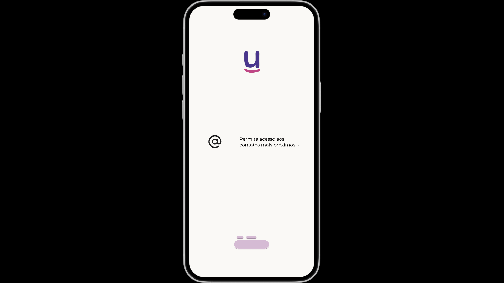
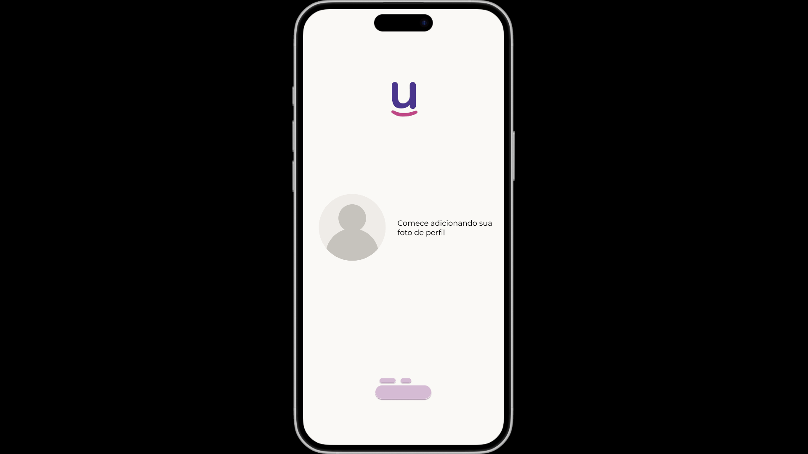

#### Atividade iniciada em 28/04/2025 por Lucas Menegon

# O que fizemos?

Union é o seu espaço para conexões autênticas e duradouras. Nosso objetivo é unir pessoas com interesses e valores similares, seja para amizades significativas ou relacionamentos amorosos. Com uma plataforma intuitiva e uma comunidade acolhedora, estamos aqui para ajudá-lo a construir relações que realmente importam. Junte-se a nós e comece a sua jornada de construção de conexões genuínas no Union.

**O Product Manager forneceu a você wireframes do produto para as versões de telefone e tablet. Como desenvolvedor de aplicativos móveis, sua tarefa é desenvolver aplicativos correspondentes com base nos wireframes fornecidos, de acordo com as necessidades específicas de desenvolvimento.**

# Descrição do Projeto e Tarefas

O desenvolvedor não precisa se preocupar com a estética exata da interface do programa e a posição dos elementos. O trabalho pode ser inconsistente com os wireframes fornecidos, mas o desenvolvedor precisa considerar adequadamente a facilidade de uso. A tarefa de desenvolvimento é dividida em duas partes, dependendo dos dispositivos.

| Dispositivo           |
|-----------------------|
| Figma: iPhone 15 Pro Max |

# Meu Design - disponível em [FIGMA](https://www.figma.com/design/HKpYk6FmKSxpndbQOCSOBY/Atividade-Aula-7?node-id=0-1&t=nmOVuk8ksZiKvTnM-1)

